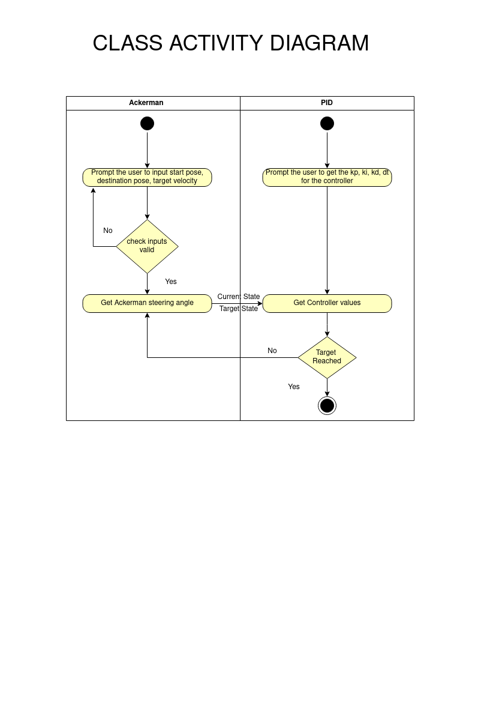
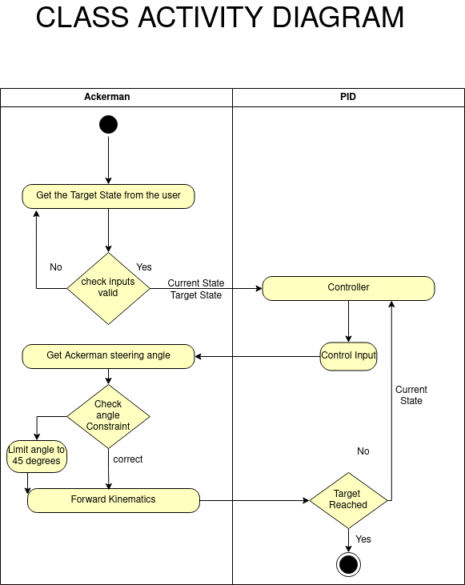
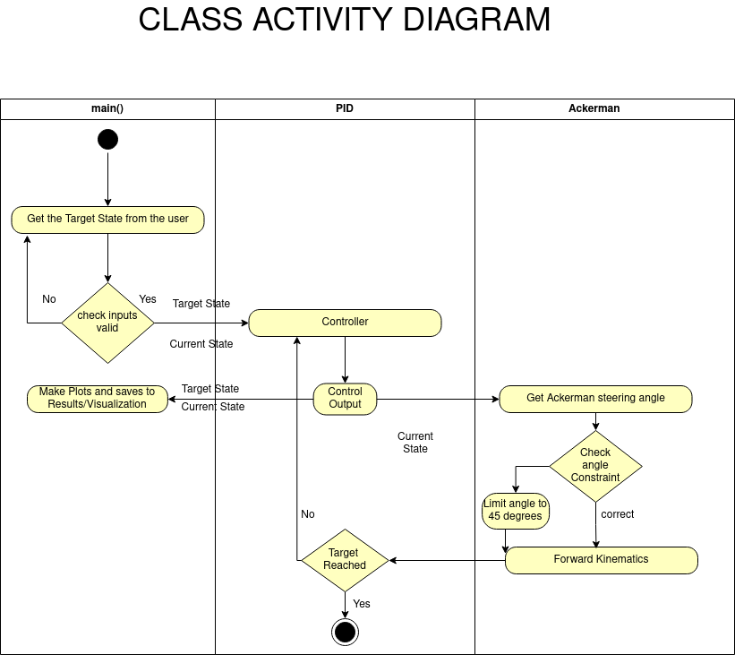
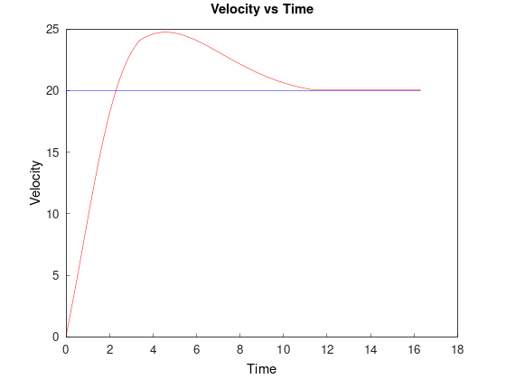
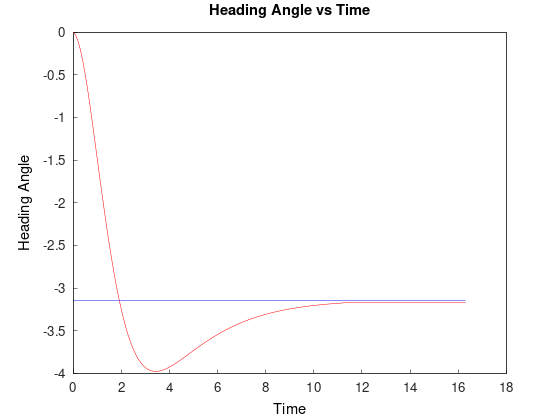
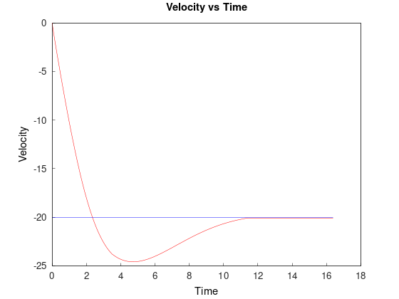
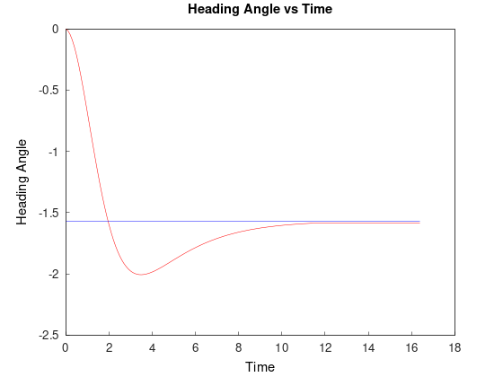

# Acme Ackerman Controller

[](https://codecov.io/gh/shivamsehgal77/Acme-Ackerman-Controller) 

[](https://opensource.org/licenses/MIT)

[](https://github.com/shivamsehgal77/Acme-Ackerman-Controller/actions/workflows/run-unit-test-and-upload-codecov.yml)

## Overview

The three basic components for a functioning robotic system are perception, planning and controls. Based on the inputs from these 3 sub systems the robot's behavior is defined. In this project we have chosen the topic of controls and decided to design a software which acts as a module of a larger self-driving car software stack. The ackerman steering is the most widely used steering constraints in robots to large automobiles. To design a module which takes into account the steering constraints and designs a controller on top of it to achieve a goal pose of the vehicle queried by any other system of the robot like perception or navigation systems.

## Team 

### Phase 0
1. [Patrik Pordi](https://www.github.com/patrikpordi) - Navigator
2. [Shivam Sehgal](https://www.github.com/shivamsehgal77) - Driver
3. [Darshit Desai](https://www.github.com/darshit-desai) - Code designer

### Phase 1
1. [Patrik Pordi](https://www.github.com/patrikpordi) - Code designer
2. [Shivam Sehgal](https://www.github.com/shivamsehgal77) - Navigator
3. [Darshit Desai](https://www.github.com/darshit-desai) - Driver

### Phase 2

#### VisualizationBranch (Merged with Dev_Iter2Branch)
1. [Patrik Pordi](https://www.github.com/patrikpordi) - Code designer
2. [Shivam Sehgal](https://www.github.com/shivamsehgal77) - Driver
3. [Darshit Desai](https://www.github.com/darshit-desai) - Navigator

#### Dev_Iter2Branch (Merged in Main)
1. [Patrik Pordi](https://www.github.com/patrikpordi) - Driver
2. [Shivam Sehgal](https://www.github.com/shivamsehgal77) - Code designer
3. [Darshit Desai](https://www.github.com/darshit-desai) - Navigator

## Phase 0:

During Phase 0, we initiated the project with a high-level design, focusing on UML, and created an activity diagram that includes classes. This diagram serves as a valuable tool for comprehending the project's process flow. Comprehensive explanations of the Phase 0 process and its implementation are available in a video accessible through this google drive [link](https://drive.google.com/file/d/1D6kjTWbVGHKaCZbz6bTfUVqyngHtdGbq/view?usp=share_link)

* The Quad Chart can be found [here](https://github.com/shivamsehgal77/Acme-Ackerman-Controller/tree/main/QuadChart/Initial_Phase0)

* The Project Proposal Report for Phase 0 can be found [here](https://github.com/shivamsehgal77/Acme-Ackerman-Controller/blob/main/Reports/Phase0/ENPM808X_Proposal_Phase0_AckermanSteeringControl.pdf)

* The Initial UML Diagrams are found [here](https://github.com/shivamsehgal77/Acme-Ackerman-Controller/tree/main/UML%20diagrams/Initial_Phase0)

* The Activity Diagram found [here](https://github.com/shivamsehgal77/Acme-Ackerman-Controller/blob/main/UML%20diagrams/Initial_Phase0/acme-ackerman-class-diagram.png)




## Phase 1:
During Phase 0 we did design and even added the stubs that we had to do for phase1. For phase1 in the first sprint meeting we decided to update the plan, correspondingly we changed UML class diagram and stubs. Product Backlog, Iteration backlog and work log excel sheet [Sheet](https://docs.google.com/spreadsheets/d/1ph1sYep433EigfkVelYI8igBHbYIN74LMEw9CF0V7-I/edit#gid=0 )
| Unique ID | Task                                                           | Sprint | Estimated Time (min) |
|-----------|----------------------------------------------------------------|--------|----------------------|
| 2.2       | Revise the UML diagrams                                        | 1      | 50                   |
| 2.3       | Create UML diagram for Robot class                             | 1      | 20                   |
| 2.4       | Creating the skeleton hpp file for the new class               | 1      | 20                   |
| 2.5       | Create iteration 1 branch                                      | 1      | 10                   |
| 2.6       | Selecting and adding the license file                          | 1      | 30                   |
| 2.7       | Implementing the solitary test for PID class                   | 1      | 20                   |
| 2.8       | Implementing the solitary test for Ackerman class              | 1      | 30                   |
| 2.9       | Cpplint errors                                                 | 1      | 10                   |
| 3         | Cppcheck errors                                                | 1      | 10                   |
| 3.1       | Revising PID hpp                                               | 1      | 40                   |
| 3.2       | Revising Ackerman hpp                                          | 1      | 30                   |
| 3.3       | Updating the cpp files                                         | 1      | 30                   |
| 3.4       | Updating the CMakeLists.txt                                    | 1      | 30                   |
| 3.5       | Update run-unit-test-code-coverage.yml file to include eigen 3 | 1      | 10                   |
| 3.6       | Updating Readme.md                                             | 1      | 30                   |

* The Revised UML Diagrams are found [here](https://github.com/shivamsehgal77/Acme-Ackerman-Controller/tree/main/UML%20diagrams/Revised_Phase1)

* The Activity Diagram found [here](https://github.com/shivamsehgal77/Acme-Ackerman-Controller/blob/main/UML%20diagrams/Revised_Phase1/acme-ackerman-class-diagram.png)


## Phase 2:
During Phase 0 we did design and even added the stubs that we had to do for phase1, in phase 2 we implemented the project. For phase2 in the the second sprint meeting we decided to update the plan, correspondingly we changed UML class diagram and stubs. Product Backlog, Iteration backlog and work log excel sheet [Sheet](https://docs.google.com/spreadsheets/d/1ph1sYep433EigfkVelYI8igBHbYIN74LMEw9CF0V7-I/edit#gid=0 )
| Unique ID | Task                                               | Sprint | Estimated Time (min) |
|-----------|----------------------------------------------------|--------|----------------------|
| 2.1       | Create iteration 2 branch                         | 2      | 10                   |
| 2.2       | Implementing the setters for the PID class       | 2      | 10                   |
| 2.3       | Implementing the getcontrollervalue function...  | 2      | 50                   |
| 2.4       | Implementing the remaining methods for ackerman  | 2      | 30                   |
| 2.5       | Implementing the remaining methods for PID       | 2      | 40                   |
| 2.6       | Implement the main function for the project      | 2      | 10                   |
| 2.7       | Tune the PID values                              | 2      | 10                   |
| 2.8       | Update run-unit-test-code-coverage.yml file...   | 2      | 30                   |
| 2.9       | Update test.cpp                                   | 2      | 40                   |
| 3         | Update the stubs according to revised UMLs       | 2      | 10                   |
| 3.1       | Research on various visualization methods        | 2      | 30                   |
| 3.2       | Create visualization                              | 2      | 50                   |
| 3.3       | Refactoring the overall code                      | 2      | 20                   |
| 3.4       | Refactor and debug the visualization               | 2      | 20                   |
| 3.5       | Revise UML diagrams                               | 2      | 10                   |
| 3.6       | Revise Activity diagrams                          | 2      | 10                   |
| 3.7       | Reorganize the file and folder structure          | 2      | 10                   |
| 3.8       | Prepare files for releasing the software package  | 2      | 30                   |
| 3.9       | Update Readme with phase 2 descriptions           | 2      | 10                   |
| 4         | Add Doxygen comments                              | 2      | 10                   |
| 4.1       | Generate Doxygen documentation                     | 2      | 10                   |
| 4.2       | Update CMakelists to include visualization        | 2      | 30                   |
| 4.3       | Cpplint errors                                   | 2      | 30                   |
| 4.4       | Cppcheck errors                                  | 2      | 30                   |
| 4.5       | Valgrind to check for memory leaks                | 2      | 20                   |
| 4.6       | Add and update .gitignore file                   | 2      | 10                   |


* The Revised UML Diagrams are found [here](https://github.com/shivamsehgal77/Acme-Ackerman-Controller/tree/main/UML%20diagrams/Revised_Phase2)

* The Activity Diagram found [here](https://github.com/shivamsehgal77/Acme-Ackerman-Controller/blob/main/UML%20diagrams/Revised_Phase2/Revised_Phase2_v1/acme-ackerman-class-diagram.png)


### Results:

The results for phase 2 are shown below, We have plotted the Heading angle vs time and Car Velocity vs time plots with the set points displayed in a separate color, We gave the setpoint as 20 m/s for Target Velocity and -3.14 radians for Target Heading Angle which means the car will execute a clockwise 180 degree heading change starting at 0 m/s and 0 radians heading.

The results show that the target is achieved in a reasonable amount of time, Our chosen wheelbase, axlewidth and WheelRadius were inspired from Tesla Model S specifications available online.

<div align="center">
  
</div>

<div align="center">
  
</div>


Additional tests show the effectiveness of our controller for edge cases like reverse motion and negative heading, The results are shown below:

<div align="center">
  
</div>

<div align="center">
  
</div>


There are unit tests in the test suite for the same along with the forward only and reverse only testcases.


## Dependencies Installation
The project requires Eigen3 and GNUPlot (Matplot++ installed during build) library installation. Follow the below procedure to install Eigen3 libraries

```bash
    # Install minimal prerequisites (Ubuntu 20.04 as reference)
    sudo apt update && sudo apt install -y cmake g++ wget unzip
    # Download and install Eigen 3
    sudo apt-get install libeigen3-dev
    # Matplot++ is installed during cmake but if there is an error during execution, Download if it gives gnuplot doesn't exist error
    sudo apt-get install gnuplot
```

## Code Build Procedure

Follow the below procedure to build the code after cloning the repository
```bash
    # Configure the project and generate a native build system:
    # Must re-run this command whenever any CMakeLists.txt file has been changed.
    cmake -S ./ -B build/
    # Compile and build the project:
    # rebuild only files that are modified since the last build
    cmake --build build/
    # Run program:
    ./build/app/shell-app
    # Clean
    cmake --build build/ --target clean
    # Clean and start over:
    rm -rf build/
```

To run the tests and generate code coverage reports:

```bash
    # Run the tests after build
    cd build/
    ctest

    # For Code Coverage Installation and build code coverage report by going to build directory
    cd ..
    sudo apt-get install gcovr lcov
    # Set the build type to Debug and WANT_COVERAGE=ON
    cmake -D WANT_COVERAGE=ON -D CMAKE_BUILD_TYPE=Debug -S ./ -B build/
    # Now, do a clean compile, run unit test, and generate the covereage report
    cmake --build build/ --clean-first --target all test_coverage
    # open a web browser to browse the test coverage report
    # open build/test_coverage/index.html or check in the directory

    # Generating Doxygen Docs 
    cmake --build build/ --target docs
    # Check the Generated Doc HTML by going to docs -> html -> index.html
```

## LICENSE

This project is open source and is released under the MIT License. You are free to use, modify, and distribute the code in accordance with the terms of the MIT License.
